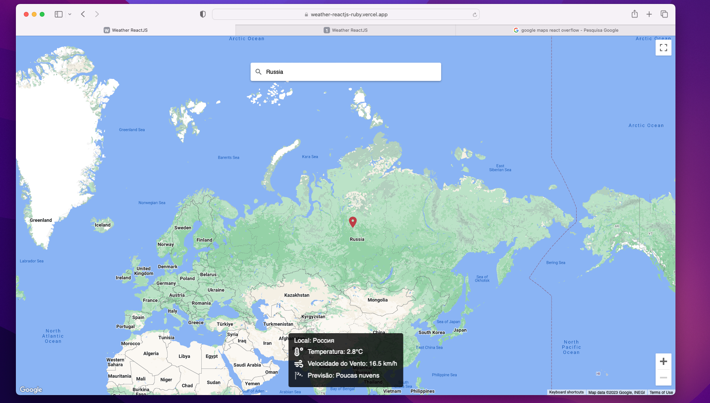

# Weather React JS

<p float="center">
  
</p>

## O Projeto

Frontend para visualizar informações meteorológicas de qualquer lugar do planeta!

## Demo

Você pode testar utilizando esse link: [https://weather-reactjs-ruby.vercel.app](https://weather-reactjs-ruby.vercel.app)

## Instalação

1. Clone o repositório: `git clone https://github.com/mateuschaves/weather-reactjs.git`
2. Instale as dependências: `npm install`
3. Configure as variáveis de ambiente no arquivo `.env` usando o modelo de exemplo em `.env.example`

## Uso

Para iniciar o projeto, utilize o seguinte comando:

```bash
    npm run dev
```


## Contribuição

1. Faça o fork do projeto
2. Crie sua feature branch (`git checkout -b feature/nome-da-feature`)
3. Commit suas mudanças (`git commit -am 'Adicionando nova feature'`)
4. Faça o push para o branch (`git push origin feature/nome-da-feature`)
5. Crie um novo Pull Request

## Licença
MIT
